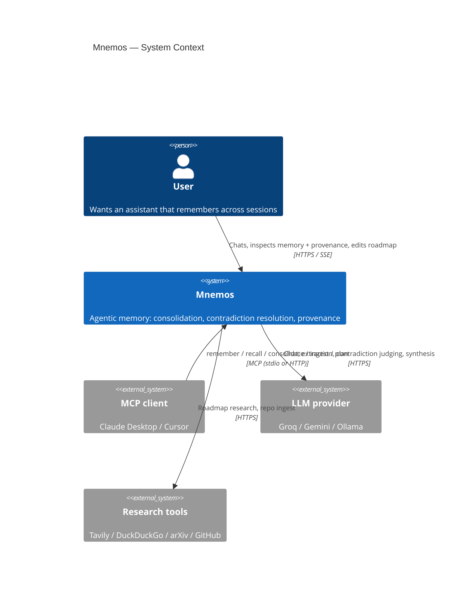
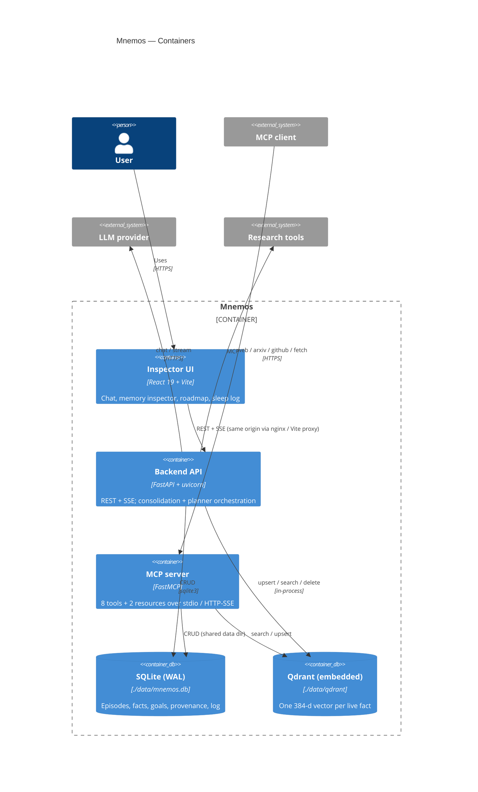
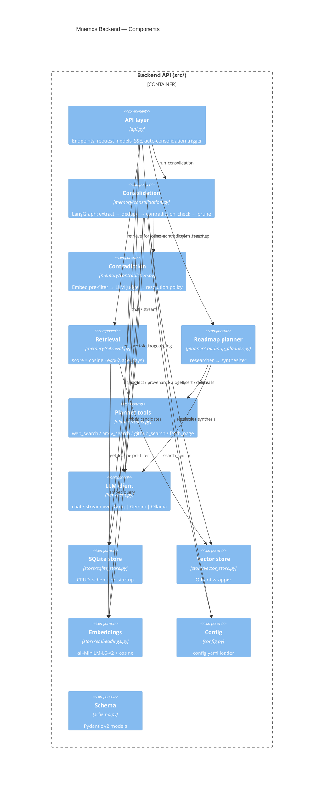
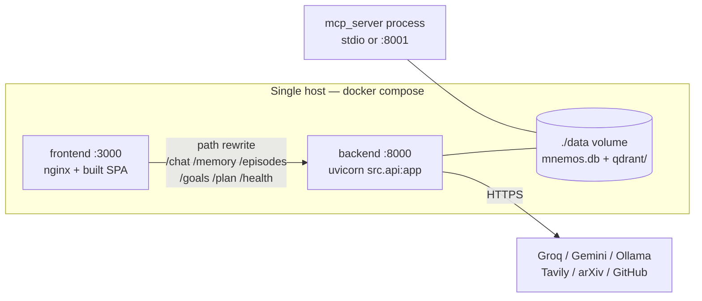

# Mnemos — C4 Model

Context → Container → Component views. Mermaid `C4` diagrams render on GitHub.
Narrative: [`HLD.md`](HLD.md) §3–§4.

---

## Level 1 — System context

---

## Level 2 — Containers

---

## Level 3 — Component view: Backend API

---

## Deployment

