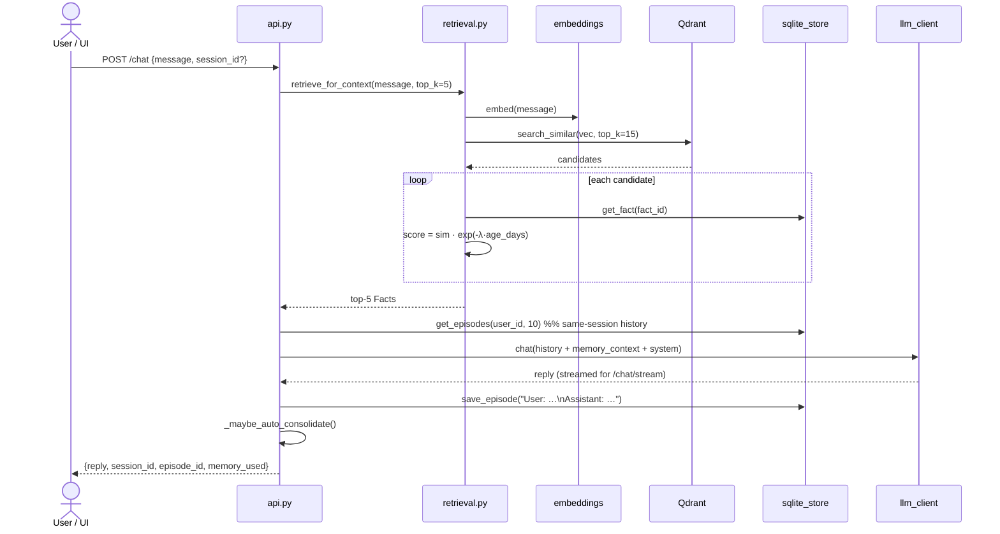
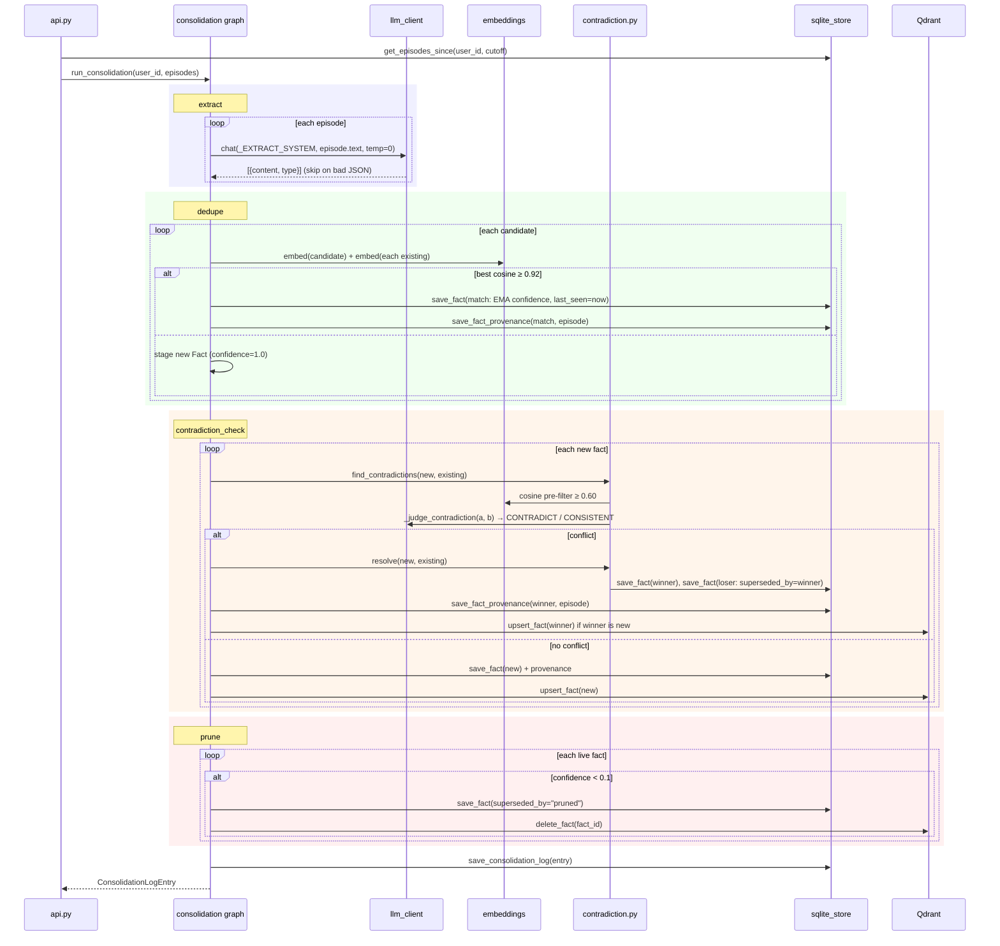
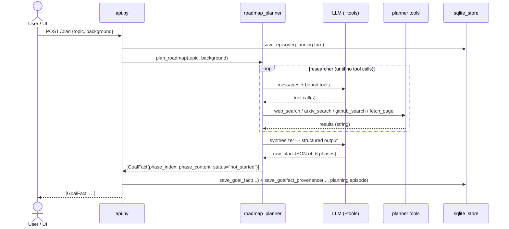
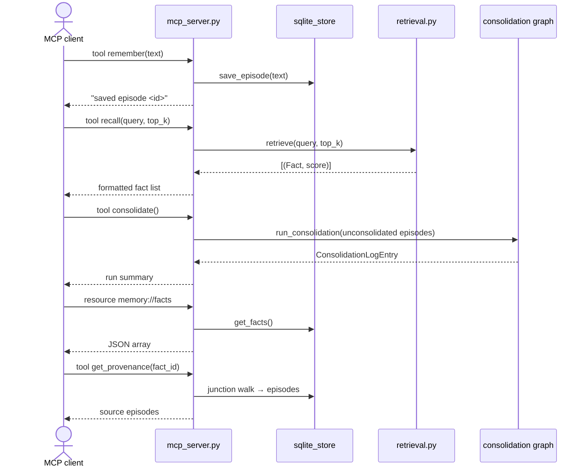
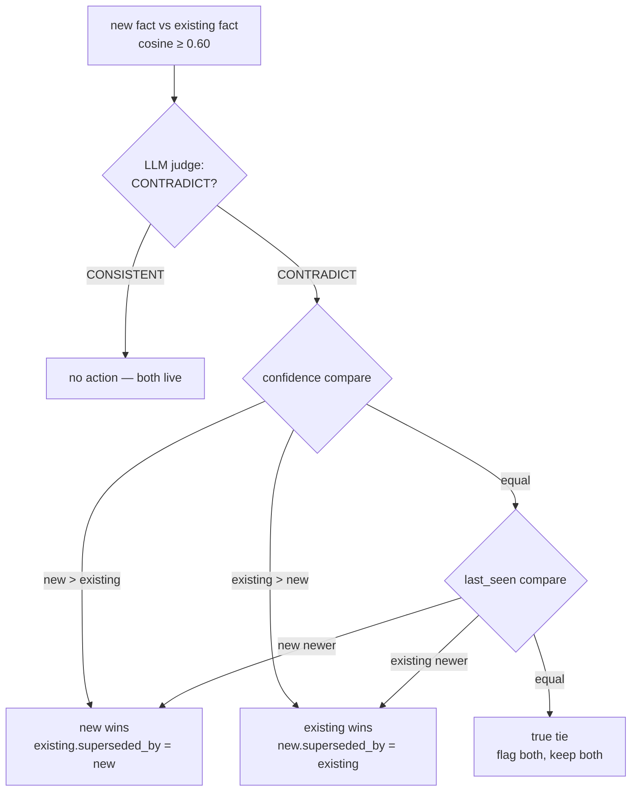

# Mnemos — Sequence Diagrams

Runtime interactions for the four core flows. Mermaid source is renderable on GitHub.
Behavioural detail: [`LLD.md`](LLD.md) §8–§13.

---

## 1. Chat turn (`POST /chat` / `POST /chat/stream`)

`_maybe_auto_consolidate` spawns a daemon thread only if
`consolidation.trigger != "manual"` and `new_episodes ≥ min_episodes_to_trigger`.

---

## 2. Consolidation — the sleep cycle (`POST /memory/consolidate`)

---

## 3. Roadmap planning (`POST /plan`)

Provider must be Groq or Gemini (tool calling); Ollama raises `ValueError`.

---

## 4. MCP client session (Claude Desktop / Cursor)

---

## 5. Contradiction resolution decision tree

